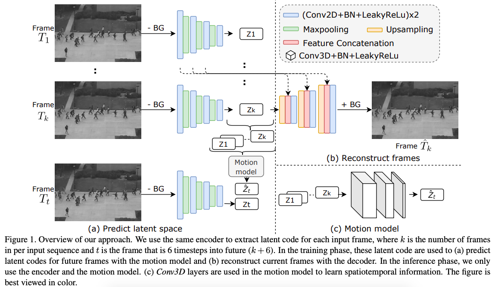

### Decoupled Appearance and Motion Learning for Efficient Anomaly Detection in Surveillance Video

This repository provides the implementation for our paper [**Decoupled appearance and motion learning for efficient anomaly detection in surveillance video** (Bo Li, Sam Leroux, and Pieter Simoens)](https://www.sciencedirect.com/science/article/pii/S107731422100093X). We experimentally show that our method achieved higher anomaly detection accuracy and inference speed than the existing works on several benchmark datasets. 

Our anomaly detection framework can be seen in the figure below:



#### Installation and preparation 

1. Clone this repo and prepare the environment:

   ```bash
   git clone https://github.com/lyn1874/daml.git
   cd daml
   ./requirement.sh download_ckpts_or_not
   Args:
       download_ckpts_or_not: bool variable. If true, then download the ckpts for ucsd1/ucsd2
   ```
   
2. Prepare the dataset:
    ```bash
    ./prepare_data.sh dataset datapath
    Args:
        dataset: UCSDped1, UCSDped2, Avenue
        datapath: the directory that you want to save the data, e.g., /tmp/anomaly_data/
    ```

#### Evaluate and Train the model

1. Evaluate the performance:
    ```bash
    ./run.sh ops dataset version ckptdownload datadir
    Args:
        ops: train, test, fps
        dataset: ucsd1, ucsd2, avenue
        version: int, experiment version, default: 0
        ckptdownload: bool variable. If true, evaluate the performance of the downloaded checkpoint. 
        datadir: the directory that you have saved your data, e.g., /tmp/anomaly_data/
    Example:
    ./run.sh test ucsd2 0 true /tmp/anomaly_data/ 
    ./run.sh fps ucsd2 0 true /tmp/anomaly_data/ 
    ```

2. Train the model:
    ```bash
    ./run.sh train ucsd1 0 false /tmp/anomaly_data/
    ```
    
#### Citation
If you use this code for your research, please cite our paper:
```
@article{LI2021103249,
title = {Decoupled appearance and motion learning for efficient anomaly detection in surveillance video},
journal = {Computer Vision and Image Understanding},
volume = {210},
pages = {103249},
year = {2021},
issn = {1077-3142},
doi = {https://doi.org/10.1016/j.cviu.2021.103249},
url = {https://www.sciencedirect.com/science/article/pii/S107731422100093X},
author = {Bo Li and Sam Leroux and Pieter Simoens},
}
```
    
    
